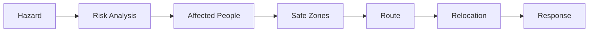
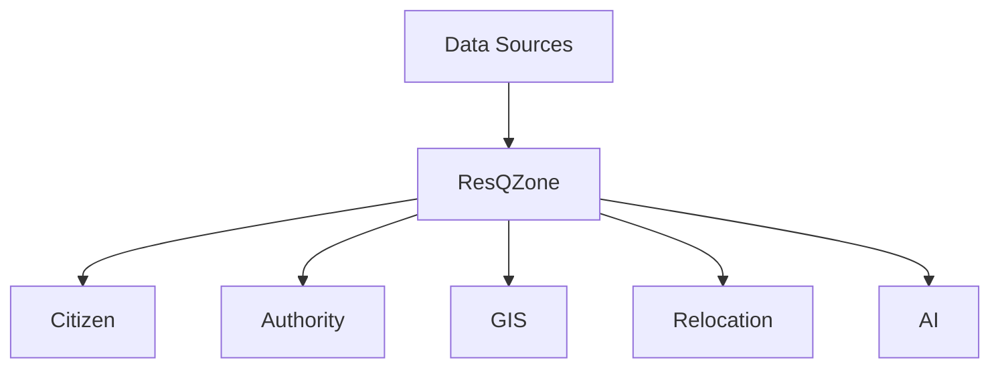
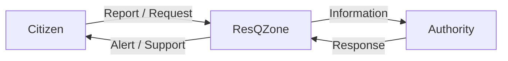

# ResQZone

### Hazard Intelligence & Relocation Support System

> ResQZone is a disaster-management platform that connects **hazard detection, GIS mapping, safe zones, relocation planning, and citizen–authority coordination** in one system.

---

## Problem

During disasters, information is often scattered across different systems.

ResQZone aims to connect:

**Hazard → Risk → People → Safe Zone → Route → Relocation → Response**

---

## Solution



---

## Key Features

| Module               | Purpose                            |
| -------------------- | ---------------------------------- |
| 👤 Citizen           | Alerts, reports, rescue requests   |
| 🏛️ Authority        | Incidents, habitations, resources  |
| 🗺️ GIS Map          | Hazards, routes and safe zones     |
| 🔄 Relocation Engine | Supports safer relocation planning |
| 📊 Analytics         | Disaster and response insights     |
| 🤖 AI Copilot        | AI-based assistance                |
| 🏠 Safe Zones        | Shelter and capacity information   |

---

## System Architecture



---

## Citizen ↔ Authority



---

## Project Structure

```text
ResQZone/
│
├── public/
│   └── assets/
│       ├── backgrounds/
│       ├── disaster/
│       ├── logo/
│       ├── rescue/
│       ├── safe-zones/
│       ├── transport/
│       └── vehicles/
│
├── src/
│   ├── components/
│   ├── auth/
│   ├── citizen/
│   ├── dashboard/
│   ├── map/
│   ├── relocation/
│   ├── analytics/
│   ├── incidents/
│   ├── habitations/
│   ├── capacity/
│   ├── copilot/
│   ├── layout/
│   └── common/
│
├── App.tsx
├── main.tsx
├── index.css
│
├── package.json
├── tsconfig.json
└── vite.config.ts
```

---

## Tech Stack

```text
Frontend      → React + TypeScript + Vite
Styling       → Tailwind CSS
Maps          → Leaflet
Charts        → Recharts
AI            → Google GenAI
UI / Icons    → Motion + Lucide React
Services      → Supabase / Express
```

---

## Data Sources

ResQZone is designed to work with multiple data categories:

* Hazard and weather information
* GIS / geographic data
* Population and habitation data
* Safe-zone information
* Emergency resources
* Verified citizen reports

> Full real-time government and emergency-service integrations can be added during production deployment.

---

## AI Role

AI works as an **assistance layer**, helping users understand information and supporting decision-making.

> **AI assists. Authorized humans decide.**

---

## Future Scope

* Real-time disaster data
* Dynamic route safety
* Live emergency resources
* Government API integration
* IoT / sensor integration
* Dynamic shelter capacity
* Advanced relocation optimization
* Large-scale deployment

---

## Run Locally

```bash
git clone <repository-url>
cd ResQZone
npm install
npm run dev
```

---

## Vision

> **ResQZone aims to move disaster management from simply showing information to supporting coordinated action.**

### Risk → Decision → Relocation → Response

---

## SIH Project

**ResQZone — Hazard & Relocation System**

Built for **Smart India Hackathon (SIH)**.
